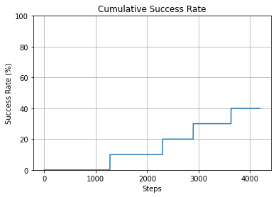
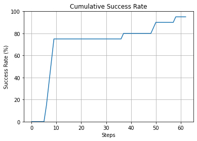

Chemical Ordering Global Optimization
=====================================

In this tutorial, we demonstrate the global optimization of chemical ordering in nanoparticles using Monte Carlo and basin-hopping algorithms.

.. code-block:: python

    from npl.core import Nanoparticle
    from npl.descriptors.local_environment_feature_classifier import LocalEnvironmentFeatureClassifier
    from npl.calculators import BayesianRRCalculator
    from npl.descriptors.global_feature_classifier import testTopologicalFeatureClassifier
    from npl.utils.utils import plot_cummulative_success_rate
    import numpy as np
    import matplotlib.pyplot as plt
    from ase.visualize import view

Creating the Nanoparticle and Optimizing
----------------------------------------

Define a function to initialize a random particle:

.. code-block:: python

    def create_start_particle(height, trunc, stoichiometry):
        start_particle = Nanoparticle()
        start_particle.truncated_octahedron(height, trunc, stoichiometry)
        return start_particle

This function generates a nanoparticle with a specific stoichiometry.

Loading the Bayesian Ridge Regression Model
-------------------------------------------

Load a pre-trained Bayesian Ridge Regression model and extract coefficients:

.. code-block:: python

    global_energy_calculator = BayesianRRCalculator.load('bayesian_rr_calculator.pkl')
    global_topological_coefficients = global_energy_calculator.get_coefficients()
    print(global_topological_coefficients)

Compute coefficients and set up the model for local calculations:

.. code-block:: python

    from npl.calculators.energy_calculator import compute_coefficients_for_linear_topological_model
    coefficients, total_energies = compute_coefficients_for_linear_topological_model(
        global_topological_coefficients, symbols, n_atoms)

Running Monte Carlo Simulation
------------------------------

Perform Monte Carlo simulation with the energy calculator:

.. code-block:: python

    from npl.monte_carlo.monte_carlo_global_features import run_monte_carlo
    feature_classifier = testTopologicalFeatureClassifier(symbols)
    start_particle = create_start_particle(5, 1, {'Au': 0.33, 'Pt': 0.67})
    beta, max_steps = 100, 100

    [best_particle, accepted_energies] = run_monte_carlo(
        beta, max_steps, start_particle, global_energy_calculator, feature_classifier)

Visualizing Results
-------------------

Use ASE to view the optimized particle and plot accepted energies:

.. code-block:: python

    view(best_particle.get_ase_atoms(), viewer='x3d')

    :alt: Cumulative Success Rate
    :align: center

Plot the cumulative success rate:

    :alt: Cumulative Success Rate
    :align: center

Running the Optimizal Exchange Algorithm
----------------------------------------

Run the optimal exchange algorithm to search for global minima:

.. code-block:: python

    from npl.optimization.basin_hopping import run_basin_hopping
    steps_BH, energies_BH = [], []
    for i in range(20):
        start_particle = create_start_particle(4, 1, {'Au': 0.33, 'Pt': 0.67})
        [best_particle, lowest_energies, flip_energy_list] = run_basin_hopping(
            start_particle, energy_calculator, total_energies, 100, 5)
        energies_BH.append(lowest_energies[-2][0])
        steps_BH.append(lowest_energies[-2][1])

Plot the cumulative success for the Optimal Exchange algorithm:

    :alt: Cumulative Success Rate
    :align: center

