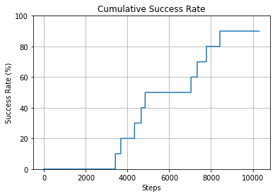
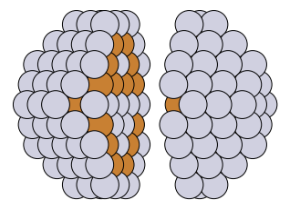
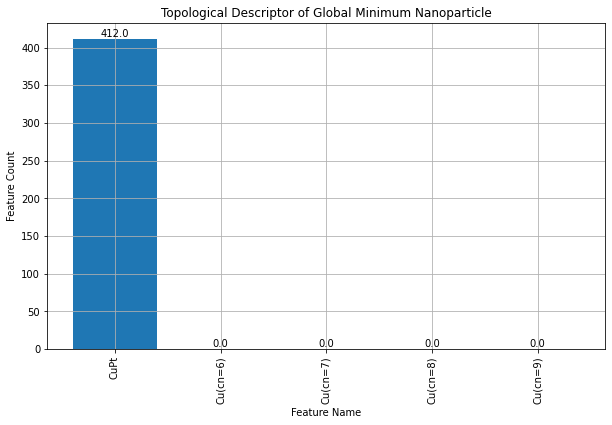

Loading a Pretrained TOP Model and Performing Chemical Ordering Optimization
==========================================================================

This tutorial demonstrates how to load a pretrained TOP model and perform a chemical ordering optimization using the `npl` library.

First, we need to import the necessary modules and initialize the `TOPCalculator` with the `ExtendedTopologicalFeaturesClassifier`.

.. code-block:: python

    from npl.descriptors import ExtendedTopologicalFeaturesClassifier
    from npl.calculators import TOPCalculator

    calc = TOPCalculator('ETOP', stoichiometry='Pt151Cu50',
                         feature_classifier=ExtendedTopologicalFeaturesClassifier)

    etop = calc.get_feature_classifier()

When the `TOPCalculator` is initialized, it will load the topological parameters for the given stoichiometry. You should see output similar to the following:

.. code-block:: text

    INFO - Loading top parameters of Pt151Cu50
    INFO - Parameters obtained from reference: L. Vega Mater. Adv., 2021, 2, 6589-6602
    INFO - Parameters loaded successfully
    INFO - Parameters: 
    {'CuPt': -25.0, 'Cu(cn=6)': 267.0, 'Cu(cn=7)': 342.0, 'Cu(cn=8)': 372.0, 'Cu(cn=9)': 372.0}

Next, we will run 20 Monte Carlo simulations to optimize the chemical ordering.

    .. code-block:: python

        from npl.monte_carlo import run_monte_carlo
        from npl.core import Nanoparticle

        beta = 250
        max_steps = 10000

        energy_calculator = calc
        feature_classifier = etop

        energies_MC, steps_MC = [], []
        for i in range(10):
            start_particle = Nanoparticle()
            start_particle.truncated_octahedron(7, 2, {'Pt': 151, 'Cu': 50})
            best_particle, accepted_energies = run_monte_carlo(beta, max_steps,
                                                               start_particle,
                                                               energy_calculator,
                                                               feature_classifier)
            min_energy, min_step = min(accepted_energies, key=lambda x: x[0])
            energies_MC.append(min_energy)
            steps_MC.append(min_step)
            if min_energy <= min(energies_MC):
                global_minimum = best_particle

Finally, we evaluate the results of our Monte Carlo simulations by looking at the cumulative success rate plot and visualizing the global minimum chemical ordering. We also plot its resulting topological descriptor.

.. code-block:: python

    from npl.visualize import plot_cummulative_success_rate

    plot_cummulative_success_rate(energies_MC, steps_MC)

    :alt: Cumulative Success Rate Plot
    :align: center

.. code-block:: python

    from npl.visualize import plot_parted_particle

    plot_parted_particle(best_particle)

    :alt: Global Minimum Nanoparticle
    :align: center

.. code-block:: python

    threshold = 1e-16
    filtered_indices = [i for i, coef in enumerate(calc.coefficients) if abs(coef) > threshold]
    feature_names = feature_classifier.get_feature_labels()

    feature_vector = best_particle.get_feature_vector(feature_classifier.get_feature_key())
    filtered_feature_vector = [feature_vector[i] for i in filtered_indices]
    filtered_feature_names = [feature_names[i] for i in filtered_indices]

    # Plot the filtered feature vector
    plt.figure(figsize=(10, 6))
    bars = plt.bar(filtered_feature_names, filtered_feature_vector)
    plt.xlabel('Feature Name')
    plt.ylabel('Feature Count')
    plt.title('Topological Descriptor of Global Minimum Nanoparticle')
    plt.xticks(rotation=90)
    plt.grid(True)

    # Annotate bars with their heights
    for bar in bars:
        yval = bar.get_height()
        plt.text(bar.get_x() + bar.get_width()/2, yval, round(yval, 2), ha='center', va='bottom')

    plt.show()

    :alt: Topological Descriptor of Global Minimum Nanoparticle
    :align: center
