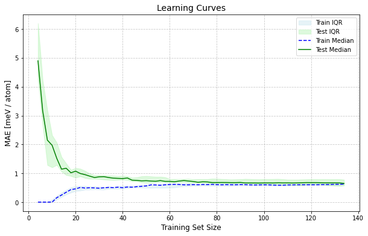
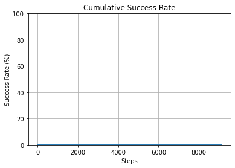

Multimetal Optimization Tutorial
================================

This tutorial demonstrates how to use the NPL (NanoParticleLibrary) for optimizing the chemical ordering in multimetallic nanoparticles.

First, import the necessary modules from the NPL library:

.. code-block:: python

    from npl.descriptors import ExtendedTopologicalFeaturesClassifier
    from npl.monte_carlo.monte_carlo_etop import run_monte_carlo
    from npl.core import Nanoparticle
    from npl.calculators import EMTCalculator
    from npl.calculators import BayesianRRCalculator
    import matplotlib.pyplot as plt
    from npl.utils.utils import plot_cummulative_success_rate, plot_learning_curves, plot_elemental_concentration_per_layer
    from ase.visualize.plot import plot_atoms

Creating the Training Set

.. code-block:: python

    def create_octahedron_training_set(n_particles, height, trunc, stoichiometry, descriptor_calculator):
        emt_calculator = EMTCalculator(fmax=0.2)

        training_set = []
        for i in range(n_particles):
            p = Nanoparticle()
            p.truncated_octahedron(height, trunc, stoichiometry)
            emt_calculator.compute_energy(p)
            descriptor_calculator.compute_feature_vector(p)
            training_set.append(p)

        return training_set

.. code-block:: python

    stoichiometry = {'Pd':0.33, 'Au' : 0.33, 'Cu' : 0.34}
    etop = ExtendedTopologicalFeaturesClassifier(list(stoichiometry.keys()))
    training_set = create_octahedron_training_set(150, 5, 1, stoichiometry, etop)
    calculator = BayesianRRCalculator(etop.get_feature_key())
    calculator.fit(training_set, 'EMT', validation_set=0.1)

.. code-block:: python

    X = [p.get_feature_vector(etop.get_feature_key()) for p in training_set]
    y = [p.get_energy('EMT') for p in training_set]
    n_atoms = training_set[0].get_n_atoms()
    plot_learning_curves(X, y, n_atoms,
                        calculator.ridge, 
                        n_splits=10, train_sizes=range(4, int(len(training_set)*0.9), 2))

.. code-block:: python

    coefficients = calculator.get_coefficients()
    feature_names = etop.get_feature_labels()
    # Filter coefficients that are not super close to 0
    threshold = 1e-16
    filtered_indices = [i for i, coef in enumerate(coefficients) if abs(coef) > threshold]
    filtered_coefficients = [coefficients[i] for i in filtered_indices]
    filtered_feature_names = [feature_names[i] for i in filtered_indices]

    # Plot the filtered coefficients
    plt.figure(figsize=(10, 6))
    plt.barh(range(len(filtered_coefficients)), filtered_coefficients)
    plt.vlines(0, 0, len(filtered_coefficients), linestyles='dashed')
    plt.yticks(range(len(filtered_coefficients)), filtered_feature_names)
    plt.ylabel('Coefficient Index')
    plt.xlabel('Coefficient Value')
    plt.title('Fitting Coefficients (Filtered)')
    plt.show()

.. figure:: ../images/3met_coefficients.png

Optimizing the Chemical Ordering

.. code-block:: python

    def create_start_particle(height, trunc, stoichiometry):
        start_particle = Nanoparticle()
        start_particle.truncated_octahedron(height, trunc, stoichiometry)
        return start_particle

    beta, max_steps = 300, 10000

    steps_MC, energies_MC = [], []
    for _ in range(10):
        start_particle = create_start_particle(6, 2, stoichiometry)
        [best_particle, accepted_energies] = run_monte_carlo(beta, max_steps, start_particle, calculator, etop)
        min_energy, min_step = min(accepted_energies, key=lambda x: x[0])
        energies_MC.append(min_energy)
        steps_MC.append(min_step)
        if min_energy <= min(energies_MC):
            global_minimum = best_particle

Plotting the Cummulative succes rate

.. code-block:: python

    plot_cummulative_success_rate(energies_MC, steps_MC)

Visualize the Global Minimum and concentration per layer

.. code-block:: python

    atoms = global_minimum.get_ase_atoms()
    atoms.center()
    atoms1 = atoms[[a.index for a in atoms if a.position[2] < atoms.get_cell()[2][2]/2 +1.0]]
    atoms2 = atoms[[a.index for a in atoms if a.position[2] > atoms.get_cell()[2][2]/2 +1.0]]
    l = 3
    atoms1.translate(( 0., 0.,-l))
    atoms2.translate(( 0., 0.,l))
    atoms = atoms1 + atoms2

    plot_atoms(atoms, rotation=('0x,75y,0z'))
    plt.axis('off')

.. figure:: ../images/3met_global_minimum.png

.. code-block:: python

    plot_elemental_concentration_per_layer(global_minimum)

.. figure:: ../images/3met_concentration_per_layer.png

References
----------
If you use this code, please cite our papers:

.. code-block:: bibtex

    @article{10.1063/5.0193848,
    author = {Farris, Riccardo and Merinov, Boris V. and Bruix, Albert and Neyman, Konstantin M.},
    title = "{Effects of Zr dopants on properties of PtNi nanoparticles for ORR catalysis: A DFT modeling}",
    journal = {The Journal of Chemical Physics},
    volume = {160},
    number = {12},
    pages = {124706},
    year = {2024},
    issn = {0021-9606},
    doi = {10.1063/5.0193848},
    url = {https://doi.org/10.1063/5.0193848},
}