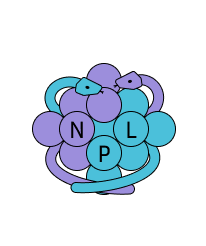

NPL - Nanoparticle Library
===========================

Overview
--------

`NPL` is a Python library for the simulation and structural optimization of nanoparticles, specifically tailored for bimetallic nanoparticles. Built on the robust `ASE` (Atomic Simulation Environment), it enables users to easily set up and analyze complex nanoparticle structures across a range of chemical compositions and structures. `NPL` provides high-level abstractions, making it accessible for both beginners and experienced researchers aiming to perform detailed nanoparticle simulations.

Features
--------

- **Surrogate Model Training**: Train surrogate energy models using both Topological Descriptors and Atomic Coordination Type descriptors, enabling accurate energy predictions with reduced computational costs.

- **Chemical Ordering Optimization**: Efficiently optimize the chemical ordering of bi- or multi-metallic nanoparticles with global optimization methods like Monte Carlo, Genetic Algorithms, and Optimal Exchange.

- **Bimetallic and Multimetallic Nanoparticles**: Specifically designed for complex bimetallic and multimetallic structures, supporting a variety of chemical compositions.

- **ASE Integration and Extensibility**: Built on ASE for simulation versatility, with modularity for custom extensions.

.. toctree::
   :caption: Contents:
   :maxdepth: 2
   
   installation
   examples
   

   

